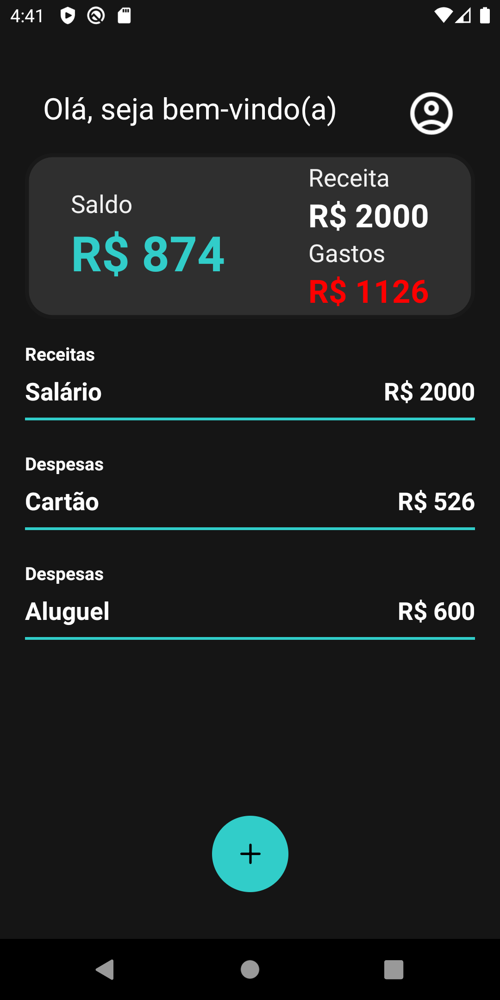
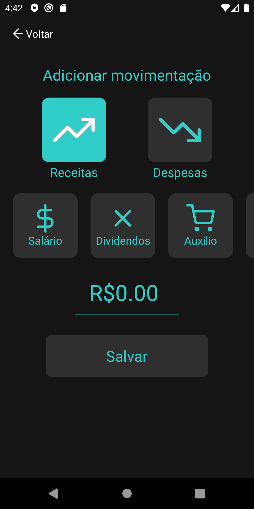
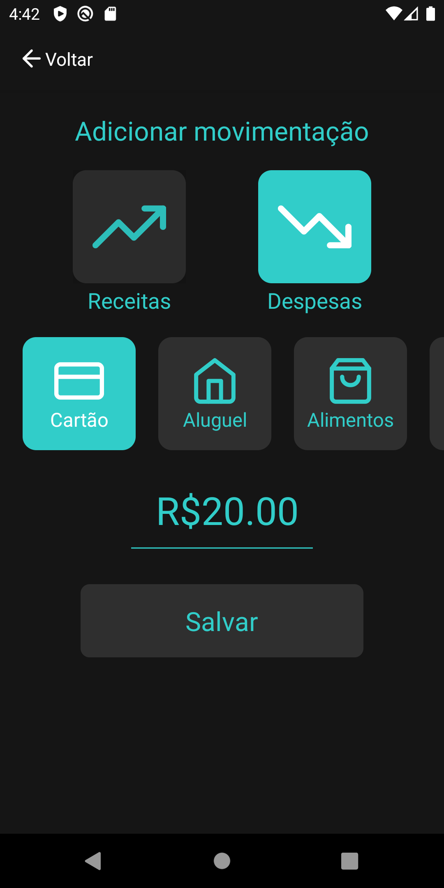

# MinhasFinancas
Minhas Finanças é um aplicativo desenvolvido em React Native. <br>

<p align="center">

</p>

# Screenshots
<p align="center">
  
  
  
</p>


## 💻:iphone:Techs 

- `React Native`
- `TypeScript`
- `Async-storage`
- `Styled-components`
---

### Clonar o repositório e instalar as dependências

```
$ git clone https://github.com/eds9nsilva/MinhasFinancas
```
```
cd DevProfile
```
##### Instalando as depedências
```
yarn ou npm install
```

> Executando. Você precisa do emulador instalado ou celular conectado via USB em modo desenvolverdor. :warning:
```
yarn start
```
---
Made with ☕ by Edson da Silva
